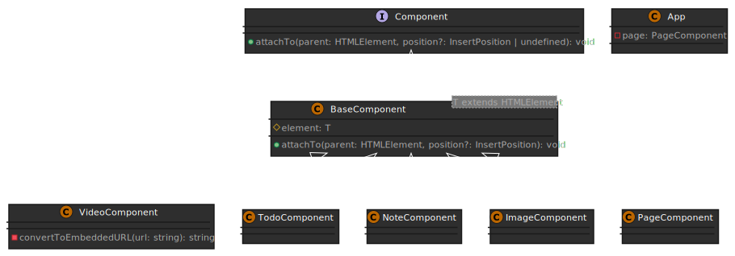
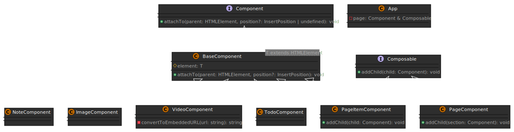
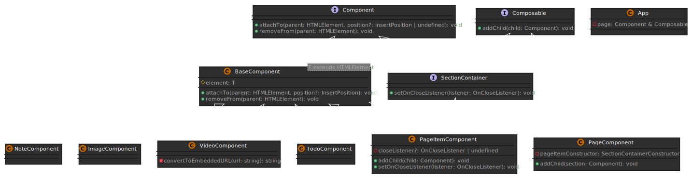
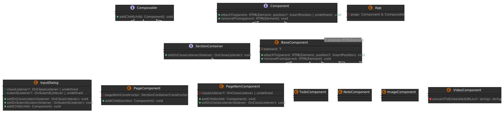
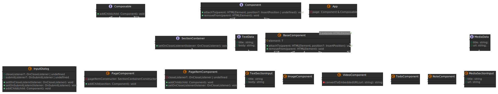
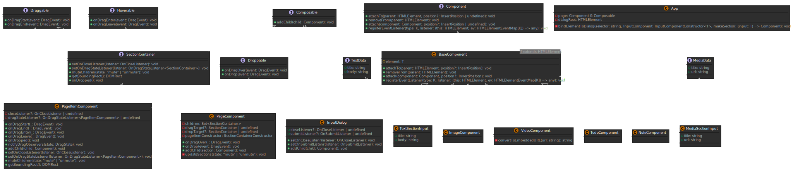

## 참고 사이트
- 디자인 영감 [드리블](https://dribbble.com/shots/14931899-TIGERS)
- 백그라운드 이미지 만드는 [사이트](https://coolbackgrounds.io/)
- 랜덤 이미지 [생성기](https://picsum.photos/)
- 정규표현식 [Regex](https://regexr.com/)
- 색상코드
```css
:root {

  --bg-main-color: #00000080;

  --bg-accent-color: #2d2d2d;

  --accent-color: #f64435;

  --text-accent-color: #ffe498;

  --text-edit-bg-color: #575757;

  --border-color: #3f3f3f;

  --shadow-color: #202020;

  --document-bg-color: #68686850;

  --component-bg-gradient: radial-gradient(circle, #646464e6 0%, #363636e6 100%);

  --smokywhite: #dddbd8;

  --black: #000000;

  --translucent-black: #00000099;

}
```
## 소스 리포지토리
[source repo link](https://github.com/dream-coding-academy/typescript_motion)

## App 컴포넌트 구조


## 단계별 클래스 다이어그램

컴포넌트를 추가하면서 그 변화와 리팩토링 요소를 확인해 보자.
### 최초 셋업


### ImageComponent 추가 후


### BaseComponent 도입 후


- B ⇢ A : B는 A를 구현 (implements)
- B → A : B는 A를 상속 (extends)

### 모든 컴포넌트 작성 후



###  PageCopmponent와 Composable 인터페이스 추가



### SectionContainer 추가
`PageComponent` 에서 `PageItemComponent`를 생성하던 것을 DI를 통해 `SectionContainer`를 사용하도록 변경하여 디커플링 완성



### InputDialog
`InputDialog` 클래스는 이것또한 동적으로 HTML요소를 생성하는 컴포넌트 이므로, `BaseComponent`를 상속하구요, 다이얼로그안에 또다른 컴포넌트 (다이얼로그안에서 사용자에게 보여줄 컨텐츠)를 담을 수 있으므로, `Composable` 인퍼테이스를 구현했어요.



### 최종 클래스 다이어그램


### Decorator를 적용한 최종판


## HTML DOM elements

최상위 노드는 EventTarget 이다. 브라우저에서 html을 이해하는 방식은 이렇게 모든 객체를 노드 타입으로 기억하는데 자바스크립트를 사용해서 그 일을 한다. 화살표는 상속 구조다. HTMLElement는 Element > Node > EventTarget 을 부모로 두고 있다.

[오브젝트 상속도]


아래는 DOM Tree.


이런 원리를 알고 있으면 element를 동적으로 만들어서 트리에 추가하는 걸 이해하기 쉽다. querySelector를 통해 특정 요소를 가져와서 동적 객체를 추가하는 것을 강의에서 확인했다.

```javascript
class App{
    private readonly page: PageComponent;
    constructor(appRoot: HTMLElement){
        this.page = new PageComponent();
        this.page.attachTo(appRoot);
    }
}

new App(document.querySelector('.document')!)
```

## InputDialog

InputDialog가 자체적으로 무엇을 보여줄지 결정해서 보여주는 것이 아니라,

InputDialog가 자체적으로 닫힘 버튼이 눌러지면 무엇을 할지 결정해서 처리 하는것이 아니라,


무엇을 보여줄지는 addChild 함수를 통해서 언제든지 안에 보여주고 싶은 컨텐츠를 외부에서, 사용하는 사람이 결정 할 수 있고,

닫힘, 제출 버튼이 눌러졌을때 어떤 일을 해야 할지도 외부에서 setOnCloseListener, setOnSubmitListener로 받아 오기 때문에,

어디서 쓰이냐에 따라 유연하게, 재사용성이 높은 클래스라고 볼 수 있어요 :)


### 미디어 url 예제
- https://youtu.be/K3-jG52XwuQ
- https://picsum.photos/600/300
- 