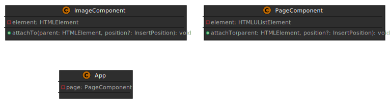

## 참고 사이트
- 디자인 영감 [드리블](https://dribbble.com/shots/14931899-TIGERS)
- 백그라운드 이미지 만드는 [사이트](https://coolbackgrounds.io/)
- 랜덤 이미지 [생성기](https://picsum.photos/)
- 색상코드
```css
:root {

  --bg-main-color: #00000080;

  --bg-accent-color: #2d2d2d;

  --accent-color: #f64435;

  --text-accent-color: #ffe498;

  --text-edit-bg-color: #575757;

  --border-color: #3f3f3f;

  --shadow-color: #202020;

  --document-bg-color: #68686850;

  --component-bg-gradient: radial-gradient(circle, #646464e6 0%, #363636e6 100%);

  --smokywhite: #dddbd8;

  --black: #000000;

  --translucent-black: #00000099;

}
```
## 소스 리포지토리
[source repo link](https://github.com/dream-coding-academy/typescript_motion)

## App 컴포넌트 구조


## 단계별 클래스 다이어그램

컴포넌트를 추가하면서 그 변화와 리팩토링 요소를 확인해 보자.

[최초 셋업]


[ImageComponent 추가 후]



[BaseComponent 도입 후]


- B ⇢ A : B는 A를 구현 (implements)
- B → A : B는 A를 상속 (extends)

## HTML DOM elements

최상위 노드는 EventTarget 이다. 브라우저에서 html을 이해하는 방식은 이렇게 모든 객체를 노드 타입으로 기억하는데 자바스크립트를 사용해서 그 일을 한다. 화살표는 상속 구조다. HTMLElement는 Element > Node > EventTarget 을 부모로 두고 있다.

[오브젝트 상속도]


아래는 DOM Tree.


이런 원리를 알고 있으면 element를 동적으로 만들어서 트리에 추가하는 걸 이해하기 쉽다. querySelector를 통해 특정 요소를 가져와서 동적 객체를 추가하는 것을 강의에서 확인했다.

```javascript
class App{
    private readonly page: PageComponent;
    constructor(appRoot: HTMLElement){
        this.page = new PageComponent();
        this.page.attachTo(appRoot);
    }
}

new App(document.querySelector('.document')!)
```